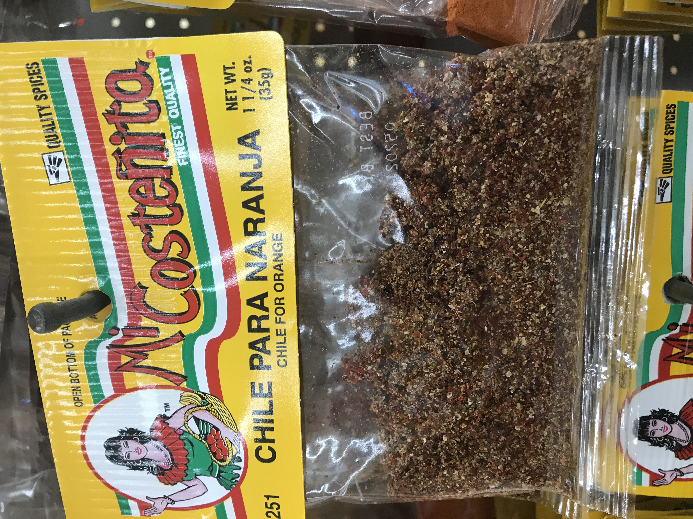
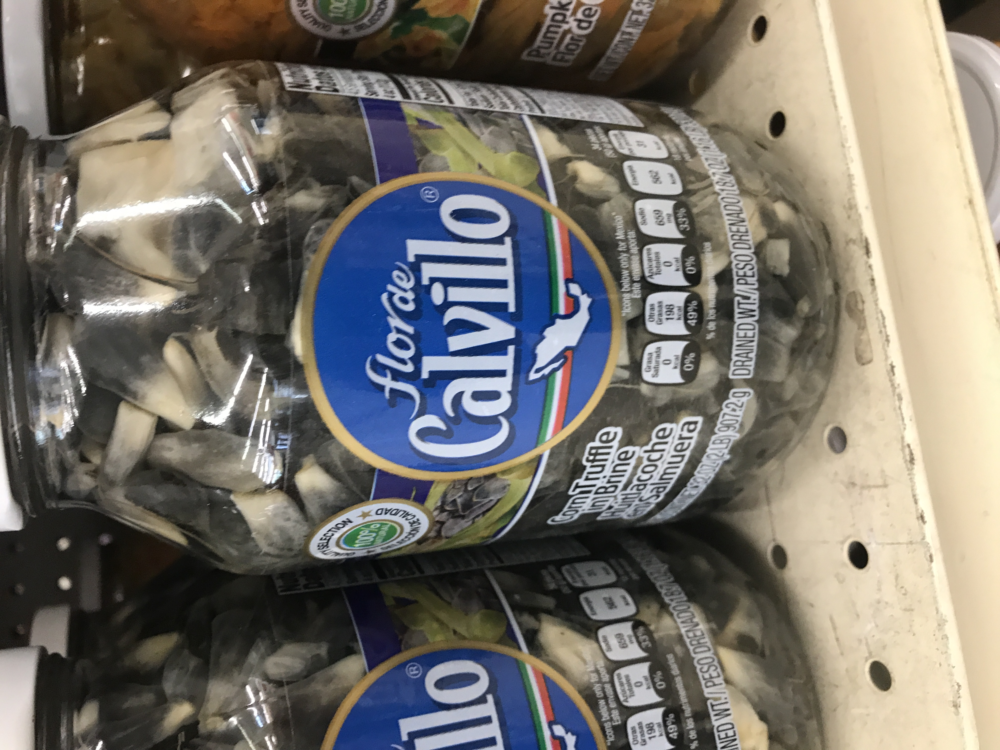
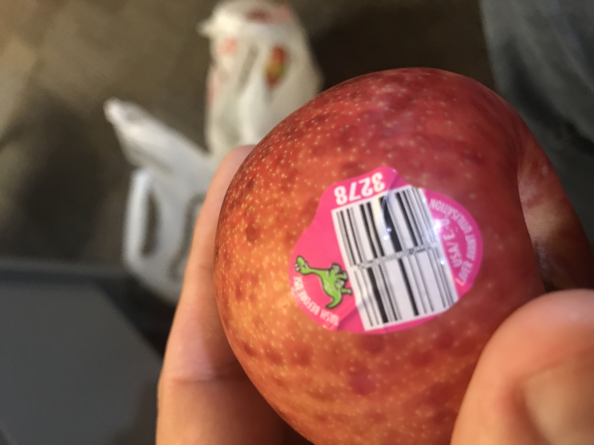
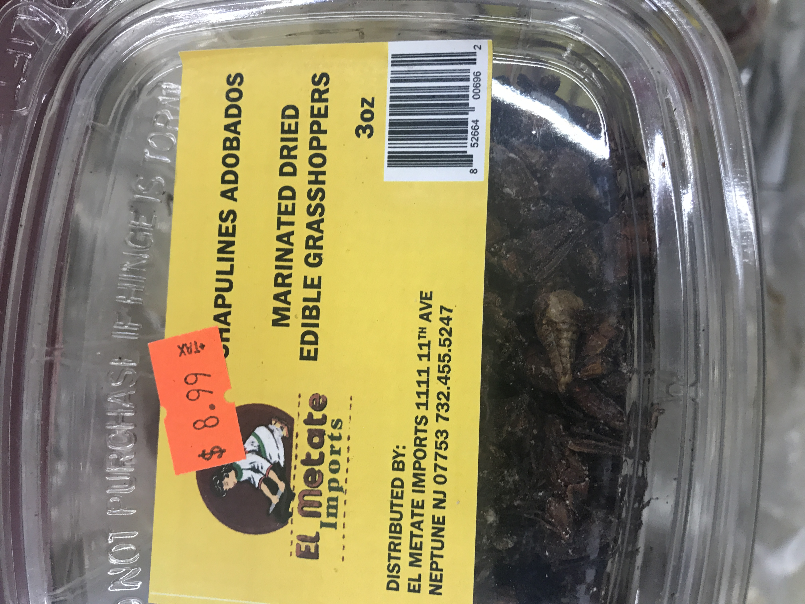
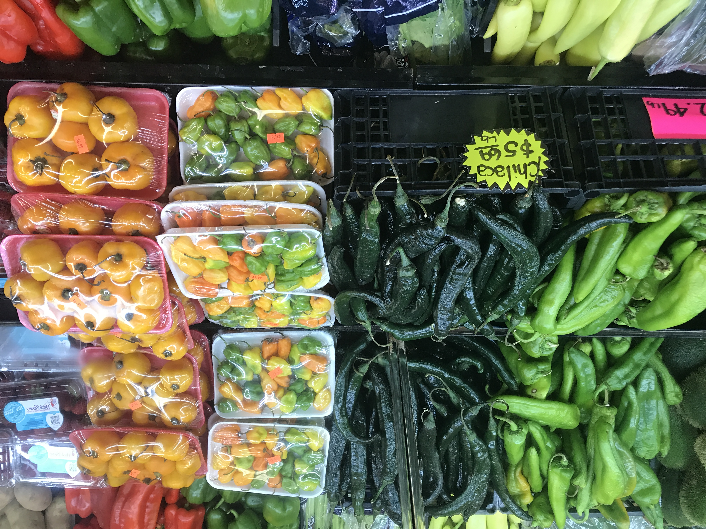
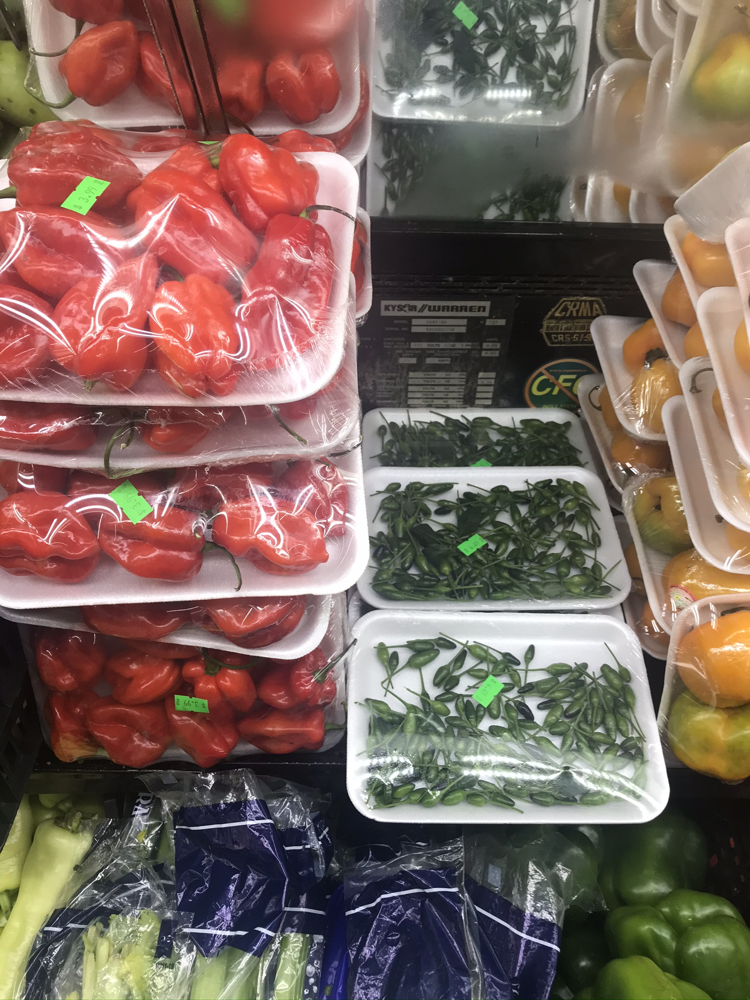
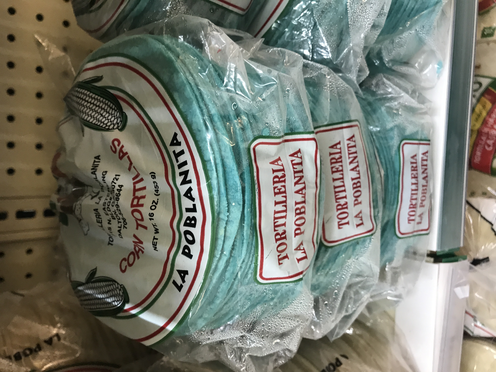
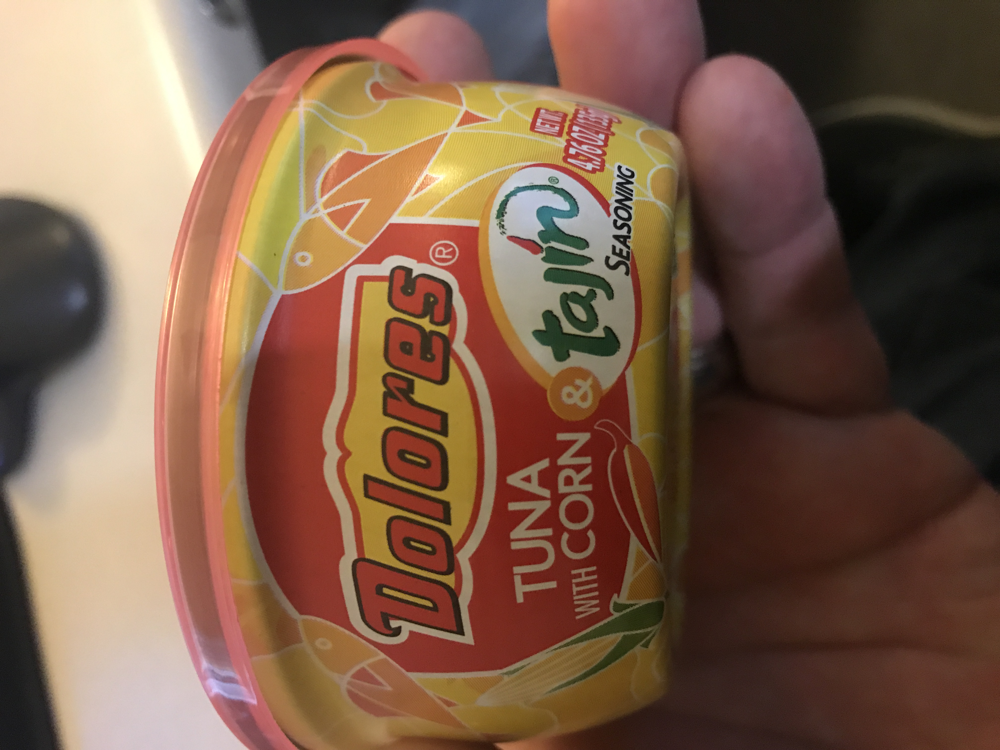

# Welcome to the wonderful offerings of the local Carniceria
I make weekly trips to pick up the freshest and rarest groceries around. A friend and I are looking to VLOG our trips to Carniceria's all over the state to showcase all the great people and groceries.

# Chili for Oranges

# Corn Fungi

# Dinosaur Egg Plums

# Grasshoppers

# Manzano Chili with black seeds!

# Fresh Peppers!

# Awesome Snacks

# Blue Tortillas

# Tuna with Corn and Tajin

